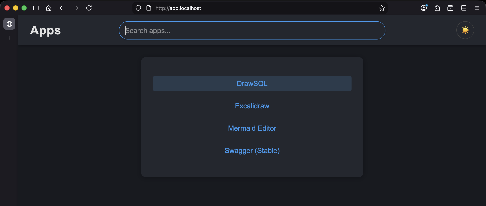

# Rocket

## Installation

For installing or updating rocket, use any of the follwing commands

```sh
curl -o- https://raw.githubusercontent.com/ayayushsharma/rocket/main/tools/install.sh | bash
```

```sh
wget -qO- https://raw.githubusercontent.com/ayayushsharma/rocket/main/tools/install.sh | bash
```

## How to use

1. Run `rocket register` and select the application you need


2. Start router and launch the installed applications. You could launch all the installed apps

```sh
rocket start
rocket launch --all
```

3. Open browser, then `app.localhost`


